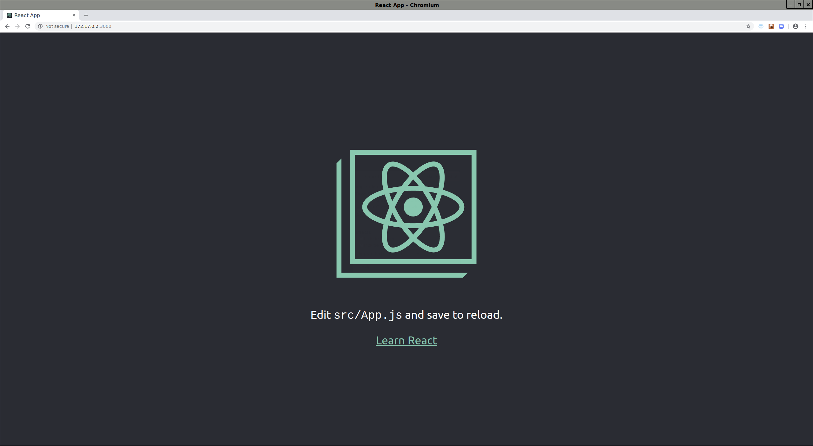

# Tic-Tac-Toe-Jim

A new wrinkle on traditional Tic-Tac-Toe - Hello, Joe!

## Prerequisites

Just for fun we will use [Docker](#docker) and [docker-compose](#docker-compose).

This will isolate us from __node.js__ vagaries as we will use the __LTS__ version.

[If you are unfamiliar with Docker, feel free to check out [my thoughts on Docker](https://github.com/mramshaw/Docker).]

#### Docker

Install the [Docker Community Edition](http://hub.docker.com/search/?type=edition&offering=community).

Verify the installation as follows:

    $ docker --version

#### docker-compose

Install [docker-compose](http://docs.docker.com/compose/install/).

Verify the installation as follows:

    $ docker-compose --version

#### node.js

Install the latest stable Docker version of [node.js](http://nodejs.org) via <kbd>docker pull node:lts</kbd>.

This should look as follows:

```bash
$ docker pull node:lts
lts: Pulling from library/node
9cc2ad81d40d: Pull complete
e6cb98e32a52: Pull complete
ae1b8d879bad: Pull complete
42cfa3699b05: Pull complete
053cac798c4e: Pull complete
e11ff976ff71: Pull complete
710b6060865b: Pull complete
ce1774bcd326: Pull complete
753f76cbf7de: Pull complete
Digest: sha256:8eab6272219cb2eef3106a2b2c72ba85627008ebe5f1471dabc76c10e688ad59
Status: Downloaded newer image for node:lts
docker.io/library/node:lts
$
```

#### create-react-app

Lets create a folder to store our react app:

    $ mkdir app

Now use the Docker version of __node.js__ to create our react app:

```bash
$ docker run --rm -it -v $(pwd)/app:/tic-tac-toe-joe node:lts /bin/bash
root@e3ec474595ce:/# npx create-react-app tic-tac-toe-joe
npx: installed 91 in 11.749s

Creating a new React app in /tic-tac-toe-joe.

Installing packages. This might take a couple of minutes.
Installing react, react-dom, and react-scripts...

yarn add v1.17.3
[1/4] Resolving packages...
[2/4] Fetching packages...
info fsevents@1.2.9: The platform "linux" is incompatible with this module.
info "fsevents@1.2.9" is an optional dependency and failed compatibility check. Excluding it from installation.
info fsevents@2.0.7: The platform "linux" is incompatible with this module.
info "fsevents@2.0.7" is an optional dependency and failed compatibility check. Excluding it from installation.
[3/4] Linking dependencies...
warning "react-scripts > @typescript-eslint/eslint-plugin@1.13.0" has incorrect peer dependency "eslint@^5.0.0".
warning "react-scripts > @typescript-eslint/parser@1.13.0" has incorrect peer dependency "eslint@^5.0.0".
warning "react-scripts > @typescript-eslint/eslint-plugin > tsutils@3.17.1" has unmet peer dependency "typescript@>=2.8.0 || >= 3.2.0-dev || >= 3.3.0-dev || >= 3.4.0-dev || >= 3.5.0-dev || >= 3.6.0-dev || >= 3.6.0-beta || >= 3.7.0-dev || >= 3.7.0-beta".
[4/4] Building fresh packages...
success Saved lockfile.
success Saved 7 new dependencies.
info Direct dependencies
├─ react-dom@16.9.0
├─ react-scripts@3.1.1
└─ react@16.9.0
info All dependencies
├─ eslint-config-react-app@5.0.1
├─ react-dev-utils@9.0.3
├─ react-dom@16.9.0
├─ react-error-overlay@6.0.1
├─ react-scripts@3.1.1
├─ react@16.9.0
└─ scheduler@0.15.0
Done in 15.08s.

Success! Created tic-tac-toe-joe at /tic-tac-toe-joe
Inside that directory, you can run several commands:

  yarn start
    Starts the development server.

  yarn build
    Bundles the app into static files for production.

  yarn test
    Starts the test runner.

  yarn eject
    Removes this tool and copies build dependencies, configuration files
    and scripts into the app directory. If you do this, you can’t go back!

We suggest that you begin by typing:

  cd tic-tac-toe-joe
  yarn start

Happy hacking!
root@e3ec474595ce:/#
```

Note that `create-react-app` uses __yarn__ (rather than __npm__) as its package manager.

However, either <kbd>npm start</kbd> or <kbd>yarn start</kbd> will work at this point:

```bash
root@e3ec474595ce:/tic-tac-toe-joe# npm start

<...>

Compiled successfully!

You can now view tic-tac-toe-joe in the browser.

  Local:            http://localhost:3000/
  On Your Network:  http://172.17.0.2:3000/

Note that the development build is not optimized.
To create a production build, use yarn build.

```

Note that the react app will now be available at: http://172.17.0.2:3000/

It should look as follows:



[As usual, __Ctrl-C__ and <kbd>exit</kbd> to terminate.]

## Credits

This is based upon the following tutorial:

    http://reactjs.org/tutorial/tutorial.html

As usual, I've tried to bundle in a few things to make it more interesting.

For instance, instead of the the usual __3 x 3__ square, I thought a __4 x 4__ square might be fun.

Also, it seemed like a good exercise to use __Docker__ and __docker-compose__.
